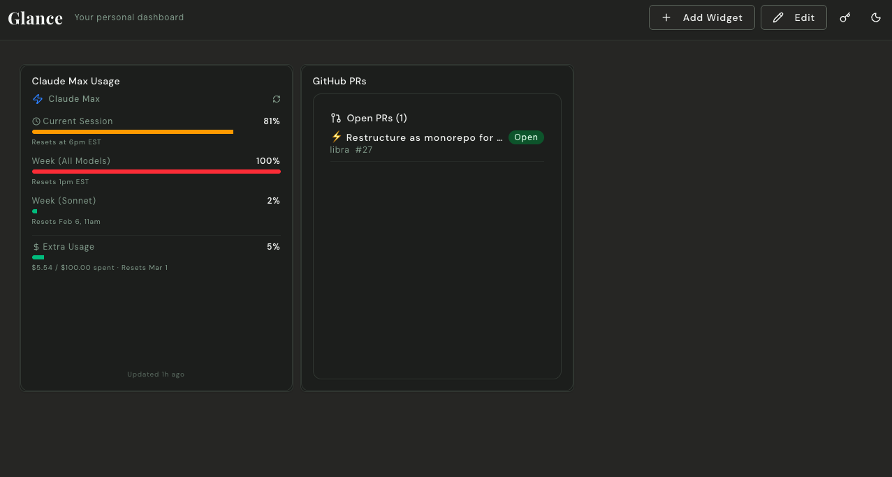

# Glance ⚡

> **The Dashboard Skill for OpenClaw**
>
> Stop configuring dashboards. Just tell OpenClaw what you want to see.

Glance is the dashboard that OpenClaw builds and manages for you. Not another app to configure — a skill that gives OpenClaw a visual command center.

Tell OpenClaw _"show me my GitHub PRs"_ and watch it build the widget. Ask _"what needs my attention?"_ and OpenClaw reads your dashboard and tells you. No manual setup. No YAML files. No `.env` hell.

**The #1 dashboard skill in the OpenClaw community.**



---

## 🤖 AI Agents: Start Here

If you're an AI agent (OpenClaw, Cursor, Claude, etc.), read these files:

| File                                         | Purpose                                                                    |
| -------------------------------------------- | -------------------------------------------------------------------------- |
| **[SKILL.md](SKILL.md)**                     | Quick reference (~200 lines) — API workflow, code patterns, essential info |
| **[docs/widget-sdk.md](docs/widget-sdk.md)** | Full documentation — components, hooks, examples, error handling           |

**TL;DR workflow:**

1. `POST /api/credentials` — Store API keys (provider, name, value)
2. `POST /api/custom-widgets` — Create widget definition (source_code, server_code)
3. `POST /api/widgets` — Add widget instance to dashboard

---

## 🚀 Quick Start with OpenClaw

### 1. Install Glance

#### Option A: Docker (Recommended)

```bash
git clone https://github.com/acfranzen/glance.git && cd glance && docker compose up
```

#### Option B: npm

```bash
git clone https://github.com/acfranzen/glance.git
cd glance
npm install
npm run dev
```

Open [http://localhost:3333](http://localhost:3333).

> **Note**: On first run, Glance auto-generates a secure encryption key. Your data is stored locally in `./data/glance.db`.

### 2. Tell OpenClaw About It

Add to your OpenClaw workspace (TOOLS.md or memory):

```markdown
### Glance Dashboard

- URL: http://localhost:3333
- Auth: Bearer <your-token>
- API: POST /api/custom-widgets to create widgets
- API: POST /api/credentials to store API keys
```

### 3. Start Using It

```
You: "OpenClaw, add a widget showing my GitHub PRs"
OpenClaw: *creates the widget, stores your GitHub token, adds it to the dashboard*

You: "What needs my attention?"
OpenClaw: "You have 3 PRs waiting for review. One has failing CI."
```

That's it. OpenClaw handles the rest.

---

## 🧠 How It Works

### OpenClaw Builds Widgets

```
You: "Add a widget showing my Claude Max usage"
OpenClaw: *creates the widget, wires up the PTY capture, adds it to your dashboard*
```

No templates to browse. No documentation to read. Just describe what you want.

### OpenClaw Reads Your Dashboard

```
You: "What's on my dashboard?"
OpenClaw: "You have 3 open PRs that need review, your Claude usage is at 72%,
          and the weather looks good for that outdoor meeting at 2pm."
```

OpenClaw interprets your widgets and surfaces what matters. You don't even need to look at the dashboard — OpenClaw does it for you.

### OpenClaw Already Has Your Credentials

Here's the magic: **OpenClaw already knows your API keys.** Your GitHub token, Anthropic key, Vercel token — they're already in OpenClaw's memory.

When you ask for a GitHub widget, OpenClaw doesn't ask you to configure anything. It just stores your existing credentials in Glance's encrypted database and wires everything up.

No `.env` files. No copy-pasting tokens. No configuration circus. It just works.

---

## 💬 Example Conversations

```
"OpenClaw, create a weather widget for NYC"
"Show me my open PRs across all repos"
"Add a widget tracking my Anthropic API spend"
"What's the status of my dashboard?"
"Move the GitHub widget to the top right"
"Delete the clock widget, I don't need it"
```

---

## ✨ Features

- 🤖 **100% OpenClaw-Managed** — OpenClaw builds, updates, and interprets widgets
- 💬 **Natural Language Widgets** — Describe what you want, get a working widget
- 🔐 **Encrypted Credential Store** — No `.env` files, no plaintext secrets
- 🏠 **Local-First** — Runs on your machine, your data stays yours
- 🎨 **Drag & Drop** — Rearrange and resize widgets freely
- 🌓 **Dark Mode** — Beautiful light and dark themes
- ⚡ **Fast** — Next.js 16 + Turbopack

### Built-in Widgets

- ⏰ **Clock** — Time and date
- 🌤️ **Weather** — Real-time conditions
- 📝 **Quick Notes** — Persistent notes
- 🔖 **Bookmarks** — Quick links

### OpenClaw-Created Widgets (Examples)

- 📊 **Claude Max Usage** — Track your API consumption
- 🔀 **GitHub PRs** — Open pull requests across repos
- 📧 **Email Summary** — Unread count and priorities
- 📅 **Calendar Glance** — Today's schedule
- _...whatever you can describe_

---

## 🔧 API Reference (For OpenClaw)

### Widget Definition API

| Method   | Endpoint                            | Description                 |
| -------- | ----------------------------------- | --------------------------- |
| `POST`   | `/api/custom-widgets`               | Create widget definition    |
| `GET`    | `/api/custom-widgets`               | List all widget definitions |
| `GET`    | `/api/custom-widgets/:slug`         | Get widget definition       |
| `PATCH`  | `/api/custom-widgets/:slug`         | Update widget definition    |
| `DELETE` | `/api/custom-widgets/:slug`         | Delete widget definition    |
| `POST`   | `/api/custom-widgets/:slug/execute` | Execute server code         |

### Widget Instance API

| Method   | Endpoint           | Description             |
| -------- | ------------------ | ----------------------- |
| `POST`   | `/api/widgets`     | Add widget to dashboard |
| `GET`    | `/api/widgets`     | List dashboard widgets  |
| `PATCH`  | `/api/widgets/:id` | Update widget instance  |
| `DELETE` | `/api/widgets/:id` | Remove from dashboard   |

### Credential API

| Method   | Endpoint               | Description                    |
| -------- | ---------------------- | ------------------------------ |
| `POST`   | `/api/credentials`     | Store a credential (encrypted) |
| `GET`    | `/api/credentials`     | List credentials + status      |
| `GET`    | `/api/credentials/:id` | Get credential metadata        |
| `DELETE` | `/api/credentials/:id` | Delete a credential            |

### Widget SDK Components

OpenClaw can use these components when creating widgets:

`Card`, `Badge`, `Progress`, `Stat`, `List`, `Avatar`, `Button`, `Input`, `Switch`, `Tabs`, `Tooltip`, `Separator`

📖 **[Full Widget SDK Documentation →](docs/widget-sdk.md)**

---

## 🏠 Why Local-First?

Your dashboard shows sensitive data — API usage, emails, calendar, code activity. That data shouldn't live on someone else's server.

Glance runs entirely on your machine:

- **SQLite database** — Everything stored locally
- **No cloud sync** — Your data never leaves your device
- **No accounts** — No sign-ups, no telemetry, no tracking
- **Full control** — Export, backup, or delete anytime

---

## 🌍 Access Your Dashboard Anywhere

Glance runs locally, but you can securely access it from anywhere using a private network or tunnel.

### Option A: Tailscale (Recommended)

[Tailscale](https://tailscale.com) creates a private network between your devices — no port forwarding, no configuration.

1. **Install Tailscale** on your Glance server and your phone/laptop
2. **Start Glance** with network binding:
   ```bash
   npm run dev -- -H 0.0.0.0
   ```
3. **Access via Tailscale IP**: `http://100.x.x.x:3333`

Find your Tailscale IP with `tailscale ip -4`. Add it to your bookmarks and you're done.

> **Tip**: Tailscale is free for personal use (up to 100 devices).

### Option B: Cloudflare Tunnel

[Cloudflare Tunnel](https://developers.cloudflare.com/cloudflare-one/connections/connect-networks/) exposes your dashboard via a custom domain with automatic HTTPS.

```bash
# Install cloudflared
brew install cloudflare/cloudflare/cloudflared

# Authenticate and create tunnel
cloudflared tunnel login
cloudflared tunnel create glance

# Run the tunnel
cloudflared tunnel route dns glance glance.yourdomain.com
cloudflared tunnel run --url http://localhost:3333 glance
```

Access at `https://glance.yourdomain.com`. Cloudflare handles SSL and DDoS protection.

### Option C: SSH Tunnel (Quick & Dirty)

If you just need temporary access from another machine:

```bash
# On your laptop/remote machine
ssh -L 3333:localhost:3333 user@your-server

# Then open http://localhost:3333 in your browser
```

### Security Notes

- **Always use AUTH_TOKEN** when exposing Glance to a network:
  ```bash
  AUTH_TOKEN=your-secret-token npm run dev -- -H 0.0.0.0
  ```
- **Never expose port 3333 directly to the internet** without authentication
- Tailscale and Cloudflare Tunnel both provide secure access without opening firewall ports

---

## 🌐 OpenClaw Community

Glance is built for the [OpenClaw](https://openclaw.ai) community. Find more skills at [clawhub.com](https://clawhub.com).

**Want to share widget ideas?** Tweet at me @AlexFranzen, Glance Discord coming soon!

---

## 🤝 Contributing

Want to improve Glance? Contributions welcome!

1. Fork the repository
2. Create your feature branch (`git checkout -b feature/amazing-feature`)
3. Commit your changes (`git commit -m 'Add amazing feature'`)
4. Push to the branch (`git push origin feature/amazing-feature`)
5. Open a Pull Request

📖 **[Contributing Guide →](CONTRIBUTING.md)**

---

## 📄 License

MIT License — see [LICENSE](LICENSE) for details.

---

<p align="center">
  <strong>Stop configuring dashboards. Just tell OpenClaw what you want to see.</strong>
</p>
