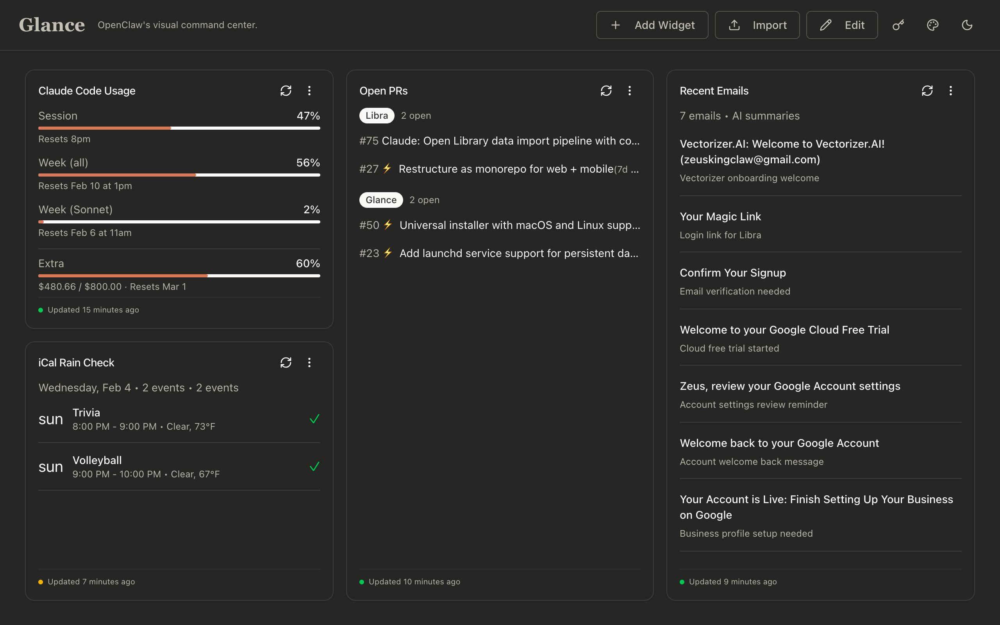

# Glance ⚡

> **The Dashboard Skill for OpenClaw**
>
> Stop configuring dashboards. Just tell OpenClaw what you want to see.

Glance is the dashboard that OpenClaw builds and manages for you. Not another app to configure — a skill that gives OpenClaw a visual command center.

Tell OpenClaw _"show me my GitHub PRs"_ and watch it build the widget. Ask _"what needs my attention?"_ and OpenClaw reads your dashboard and tells you. No manual setup. No YAML files. No `.env` hell.

**The #1 dashboard skill in the OpenClaw community.**



---

## 🚀 Quick Start with OpenClaw

### 1. Install Glance

#### Option A: Docker (Recommended)

```bash
git clone https://github.com/acfranzen/glance.git && cd glance && docker compose up
```

#### Option B: npm

```bash
git clone https://github.com/acfranzen/glance.git
cd glance
npm install
npm run dev
```

Open [http://localhost:3333](http://localhost:3333).

> **Note**: On first run, Glance auto-generates a secure encryption key. Your data is stored locally in `./data/glance.db`.

### 2. Tell OpenClaw About It

Add to your OpenClaw workspace (TOOLS.md or memory):

```markdown
### Glance Dashboard

- URL: http://localhost:3333
- Auth: Bearer <your-token>
- API: POST /api/custom-widgets to create widgets
- API: POST /api/credentials to store API keys
```

### 3. Start Using It

```
You: "OpenClaw, add a widget showing my GitHub PRs"
OpenClaw: *creates the widget, stores your GitHub token, adds it to the dashboard*

You: "What needs my attention?"
OpenClaw: "You have 3 PRs waiting for review. One has failing CI."
```

That's it. OpenClaw handles the rest.

---

## Platform Direction

Glance is evolving into a lean, contract-first widget platform for solo developers and small teams.

- **Instant generation loop**: prompt -> working widget -> iterate in minutes.
- **Simple, stable contracts**: versioned widget/connector/execution manifests with strict validation.
- **Clear credential UX**: connect-test-save flow, encrypted local secrets, explicit secret references.
- **Shareable widget packs**: publish/install widgets, connector recipes, and templates with trust metadata.
- **Practical guardrails**: safe runtime profiles, permission checks, egress controls, and better auth defaults.
- **MVP-safe migration**: keep `/api/widgets`, `/api/custom-widgets`, and `/api/credentials` compatible while `/api/v2/*` rolls out.

Read the full plan: **[Platform Overhaul Plan](docs/platform-overhaul-plan.md)**

---

## 🧠 How It Works

### OpenClaw Builds Widgets

```
You: "Add a widget showing my Claude Max usage"
OpenClaw: *creates the widget, wires up the PTY capture, adds it to your dashboard*
```

No templates to browse. No documentation to read. Just describe what you want.

### OpenClaw Reads Your Dashboard

```
You: "What's on my dashboard?"
OpenClaw: "You have 3 open PRs that need review, your Claude usage is at 72%,
          and the weather looks good for that outdoor meeting at 2pm."
```

OpenClaw interprets your widgets and surfaces what matters. You don't even need to look at the dashboard — OpenClaw does it for you.

### OpenClaw Manages Credentials

Forget `.env` files, environment variables, and copy-pasting API keys.

Glance stores credentials in an **encrypted SQLite database** (AES-256-GCM). OpenClaw manages them via API — you just say _"here's my GitHub token"_ and OpenClaw handles the rest.

---

## 💬 Example Conversations

```
"OpenClaw, create a weather widget for NYC"
"Show me my open PRs across all repos"
"Add a widget tracking my Anthropic API spend"
"What's the status of my dashboard?"
"Move the GitHub widget to the top right"
"Delete the clock widget, I don't need it"
```

---

## ✨ Features

- 🤖 **100% OpenClaw-Managed** — OpenClaw builds, updates, and interprets widgets
- 💬 **Natural Language Widgets** — Describe what you want, get a working widget
- 🔐 **Encrypted Credential Store** — No `.env` files, no plaintext secrets
- 🏠 **Local-First** — Runs on your machine, your data stays yours
- 🎨 **Drag & Drop** — Rearrange and resize widgets freely
- 🌓 **Dark Mode** — Beautiful light and dark themes
- ⚡ **Fast** — Next.js 16 + Turbopack

### Built-in Widgets

- ⏰ **Clock** — Time and date
- 🌤️ **Weather** — Real-time conditions
- 📝 **Quick Notes** — Persistent notes
- 🔖 **Bookmarks** — Quick links

### OpenClaw-Created Widgets (Examples)

- 📊 **Claude Max Usage** — Track your API consumption
- 🔀 **GitHub PRs** — Open pull requests across repos
- 📧 **Email Summary** — Unread count and priorities
- 📅 **Calendar Glance** — Today's schedule
- _...whatever you can describe_

---

## 🔧 API Reference (For OpenClaw)

### Widget API

| Method   | Endpoint                          | Description                                  |
| -------- | --------------------------------- | -------------------------------------------- |
| `POST`   | `/api/custom-widgets`             | Create a widget (JSX + optional server code) |
| `GET`    | `/api/custom-widgets`             | List all widgets                             |
| `GET`    | `/api/custom-widgets/:id`         | Get widget details                           |
| `PUT`    | `/api/custom-widgets/:id`         | Update a widget                              |
| `DELETE` | `/api/custom-widgets/:id`         | Remove a widget                              |
| `GET`    | `/api/custom-widgets/:id/data`    | Get widget's current data                    |
| `POST`   | `/api/custom-widgets/:id/execute` | Run widget's server code                     |

### Credential API

| Method   | Endpoint                | Description                    |
| -------- | ----------------------- | ------------------------------ |
| `POST`   | `/api/credentials`      | Store a credential (encrypted) |
| `GET`    | `/api/credentials`      | List credential keys           |
| `GET`    | `/api/credentials/:key` | Retrieve a credential          |
| `DELETE` | `/api/credentials/:key` | Remove a credential            |

### Widget SDK Components

OpenClaw can use these components when creating widgets:

`Card`, `Badge`, `Progress`, `Stat`, `Skeleton`, `Button`, `List`, `Avatar`, `Separator`, `ScrollArea`

All components are from [shadcn/ui](https://ui.shadcn.com) — accessible via the `SDK` namespace.

📖 **[Full Widget SDK Documentation →](docs/widget-sdk.md)**
📐 **[Contract-First Validation Guide →](docs/widget-contract-first.md)**
🧭 **[V2 Migration Guide →](docs/migration-guide-v2.md)**
🛠️ **[V2 Platform Runbook →](docs/runbook-v2-platform.md)**

---

## 🏠 Why Local-First?

Your dashboard shows sensitive data — API usage, emails, calendar, code activity. That data shouldn't live on someone else's server.

Glance runs entirely on your machine:

- **SQLite database** — Everything stored locally
- **No cloud sync** — Your data never leaves your device
- **No accounts** — No sign-ups, no telemetry, no tracking
- **Full control** — Export, backup, or delete anytime

---

## 🌐 OpenClaw Community

Glance is built for the [OpenClaw](https://openclaw.ai) community. Find more skills at [clawhub.com](https://clawhub.com).

**Want to share widget ideas?** Tweet at me @AlexFranzen, Glance Discord coming soon!

---

## 🤝 Contributing

Want to improve Glance? Contributions welcome!

1. Fork the repository
2. Create your feature branch (`git checkout -b feature/amazing-feature`)
3. Commit your changes (`git commit -m 'Add amazing feature'`)
4. Push to the branch (`git push origin feature/amazing-feature`)
5. Open a Pull Request

📖 **[Contributing Guide →](CONTRIBUTING.md)**

---

## 📄 License

MIT License — see [LICENSE](LICENSE) for details.

---

<p align="center">
  <strong>Stop configuring dashboards. Just tell OpenClaw what you want to see.</strong>
</p>
